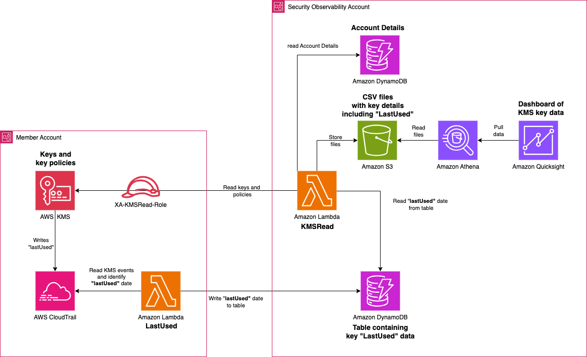
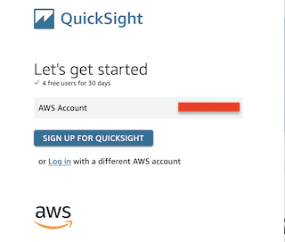
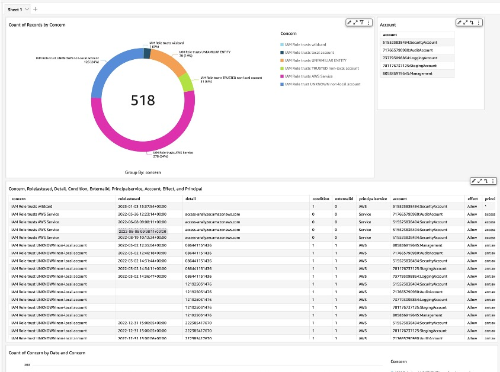
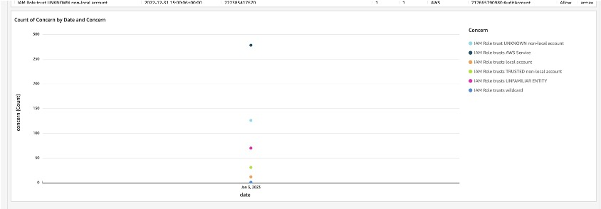

# re:Inforce 2024 - DAP241
# Keys to the Castle: Tracking AWS KMS key policies using Amazon QuickSight

## Architecture


## Overview

This code talk describes a solution for building a KMS observability platform.
Resources are deployed in one of two account types:
1. **Security Observability Account** - Hosts the central resources (e.g DynamoDB tables) and dashboarding
2. **Member Accounts** - Hosts the resources used to enable the scanning of KMS keys and Cloudtrail to be loaded into the dashboarding

This git repository contains a services of CloudFormation scripts for deploying into these two accounts types.
It consists of the following components:

### 1. Security Observability Account
* ***security-account-dynamodb.yaml***
  Deploys the following resources
  * *Accounts* DynamoDB table used to store a list of accounts for scanning
  * *Last Used* DynamoDB table used to store the date and time of when a KMS key was last used
  * ReadOnly DynamoDB IAM Role with a default name of `ReadDynamoDB-Role`
  * Write Access DynamoDB IAM role used to Put objects. Default name of `putToDynamoRole`

* ***security-account-kmsread-lambda.yaml***
  Deploys the following resources:
  * *KMSRead* Lambda.  This runs from the Security Observability role. It reads the list of accounts from the *accounts* DynamoDB table, assumes a role into all member accounts & regions and then scans all KMS keys and policies before storing them in a CSV in S3
  * S3 Bucket used to store the CSV files
  * S3 Bucket policy allowing *KMSRead* Lambda to write to the bucket
  * IAM role for *KMSRead* Lambda.  Has permissions to assume the *XA-KMSRead-Role* role in member accounts and read from the *accounts* DynamoDB table
  * EventBridge rule to trigger the Lambda on a cron schedule: every 24 hours

* ***security-account-athena.yaml***  
  Deploys the following resources:
  * Athena workgroup
  * Requred Athena buckets
  * Associated IAM Roles for Athena
  * QuickSight IAM Role
  
### 2. Member Accounts
* ***member-account-kmsread-role.yaml***  
  Deploys the following resources:
  * IAM role with a default name of `XA-KMSRead-Role` that has permissions to read KMS keys and policies.  This role is assumed in all member accounts by the *KMSRead* Lambda function in the Security Observability account
* ***member-account-lastused-lambda.yaml***  
  Deploys the following resources:
  * *LastUsed* Lambda function. Runs in member accounts and scans CloudTrail searching the `kms.amazonaws.com` event source for the last time a KMS key was used. It updates the entry for each KMS keyid found in CloudTrail in the *lastUsed* DynamoDB table in the Security Observability account
  * Log Group settings set to delete logs after 90 days
  * IAM Role with permissions to assume the `putToDynamoRole` in the Security Observability account (also has permissions to write directly to the table but not currently used as the DynamoDB table has no resource policy)
  * EventBridge rule to trigger the Lambda on a cron schedule: also every 24 hours.  Should run **before** the KMSRead function.
* ***member-account-sample-kms-keys.yaml*** **OPTIONAL**
  
  Deploys the following resources:
  * Two IAM Users - `Alice` and `Bob`
  * Two IAM Roles - `Administrator` and `Developer`
  * 11x different KMS keys with varying key policies
  * 5x KMS Key aliases


## Instructions
### 1. Security Observability Account
Deploy the following:
| Order | filename | Stack / Stackset | Single Region / Multi-Region|
| ----- | ----- | ----- | ----- |
| # 1 | [security-account-dynamodb.yaml](security-account-dynamodb.yaml) | Stack | Single |
| # 2 | [security-account-kmsread-lambda.yaml](security-account-kmsread-lambda.yaml) | Stack | Single |
| # 3 | [security-account-athena.yaml](security-account-athena.yaml) | Stack | Single |

### 2. All Member Accounts
Deploy the following as StackSets from your **`Management`** account / [delegated CloudFormation account](https://docs.aws.amazon.com/AWSCloudFormation/latest/UserGuide/stacksets-orgs-delegated-admin.html):
| Order | filename | Stack / Stackset | Single Region / Multi-Region|
| ----- | ----- | ----- | ----- |
| # 1 | [member-account-kmsread-role.yaml](member-account-kmsread-role.yaml) | StackSet | **SINGLE e.g. `us-east-1`** |
| # 2 | [member-account-lastused-lambda.yaml](security-account-lastused-lambda.yaml) | StackSet | **MULTI** |
| # 3 | [member-account-kmsread-role.yaml](member-account-kmsread-role.yaml) | **Stack** (to deploy in Management account) | **SINGLE e.g. `us-east-1`** |
| # 4 | [member-account-lastused-lambda.yaml](security-account-lastused-lambda.yaml) | **Stack** (to deploy in Management account) | **MULTI** |
| **OPTIONAL!** | [member-account-sample-kms-keys.yaml](security-account-sample-kms-keys.yaml) | StackSet | **SINGLE e.g. `us-east-1`** |

### 3. Populate `accounts` DynamoDB table
The `accounts` DynamoDB table needs to be populated. The easiest way is to log into the **`Management`** account and run the following command:

    aws organizations list-accounts --query "Accounts[?Status=='ACTIVE'].{accountId:Id, accountEmail:Email}" --output json > ~/accounts.json

Manually augment the accounts.json with the account names using the `accountName` key to end up with a file that looks similar to this:


````
[
    {
        "accountId": "123456789012",
        "accountName": "Development",
        "accountEmail": "goffalex+development@amazon.co.uk"
    },
    {
        "accountId": "987654321098",
        "accountName": "SystemTest",
        "accountEmail": "goffalex+systest@amazon.co.uk"
    }
]
````

Add the entries using this command:

    python putDynamo.py -f <FILENAME> -t <TABLENAME> -r <REGION>

e.g.

    python putDynamo.py -f accounts.json -t accounts -r us-east-1


### 4. Configure Quicksight Dashboard

#### **4.1. Create the Amazon QuickSight resources**

##### **Subscribe to Amazon QuickSight**

* Sign in to your AWS account and open Amazon QuickSight from the AWS Management Console. It is located under Analytics, and you can find it by searching for "QuickSight".
* Your AWS account number is displayed for verification purposes. Choose Sign up for QuickSight.
* 
* Choose Enterprise. To confirm, choose Continue. A screen titled Create your QuickSight accountappears.
* Configure Authentication as appropriate.  ‘Use IAM federated identities & QuickSight-managed users“
* Under Account info:
    * Type in a unique account name for Amazon QuickSight. For example, use `yourname-YYYYMMDD-quicksight` in the QuickSight account name field. Your account name can only contain characters (A–Z and a–z), digits (0–9), and hyphens (-).
    * Type in a notification email addess in the Notification email address field. This email receives service and usage notifications.
* Under **‘Allow access and autodiscovery for these resources’** the following should be checked: Amazon Redshift, Amazon RDS, IAM and Amazon Athena checkboxes are checked.
* Click **‘Select S3 buckets’** and add the ‘``kms-read-policy-XXXXXXXXXXXX-REGION``’ and the bucket containing ``‘kmsdashboard-athenaworkgroupbucket-XXXXXXXXXXXX-REGION’``. as well as the ``'kmsdashboard-athena-loggingbucket-XXXXXXXXXXX-REGION-’``  Check the box to the left and also for **‘Write permission for Athena Workgroup’.** Click Finish.
* Deselect "Paginated reports"
* Review the choices you made, then choose Finish.
* Once the Amazon QuickSight account creation process is finished, choose Go to Amazon QuickSight to go to the Amazon QuickSight home page.

#### **4.2 Create a new Dataset**

* Open Amazon QuickSight from the AWS Management Console. It is located under Analytics, and you can find it by searching for "QuickSight". On the left pane, choose Datasets.
* Log in to the right region - e.g. ``‘Ireland’``
* On the top right corner, choose New dataset.
* Under the section FROM NEW DATA SOURCES, choose Athena.
* Under Data source name, type in a name for the data source. For example, enter`kmsdashboard-datasource`.
* Select Athena workgroup `kmsdashboard-athena-workgroup.`
* Click `Validate connection` to test access.
* Choose `Create data source` and wait for the popup to refresh with the new dataset.
* Under Database: contain sets of tables., choose the database `kmsdashboarddatabase`
* Under Tables: choose the data to visualise.   Select the `kmsdashboardtable` and chooseEdit/Preview data and wait for data set to be opened.
* In the new view, select `State` and change it from `State` to `String`
* In the new view, select `date` and change it from a `String` to a `Date`
* Enter a data format of `yyyy-MM-dd` and click `Validate` and then `Update`
* In the bottom left, change the ‘Query mode’ from Direct query to ‘SPICE’
* On the top right corner, save your changes with Save & Publish.
* Then click Publish and Visualize to open the design window
* Click `Cancel` on the pop-up
* REMEMBER TO SET A REFRESH SCHEDULE FOR SPICE DATA

####  **4.3 Visuals**

Your final dashboard will look something like this:  




##### **4.3.1 Create QuickSight Analysis - Visual: Count of Records by Concern**

* (If you didn't follow the steps before, open the analysis from the Quicksight home page.)
* Click on ‘Analyses’ → New Analysis
* Select the ‘``kmsdashboardtable``’ Dataset.
* Check the summary and then click ‘``Use in analysis``’ in the top right.
* Select the `visual` which says "AutoGraph" on "Sheet 1".
* On the bottom left, select as visual type Donut Chart.
* Drag & drop the `‘concern’` field from the left `Fields list` into the `Group/Color` field on the top.
* Make the visual wider and resize the ‘concern’ legend on the right to view the full sentences.
* Visuals
    * In the top right of the visual, click the pencil icon to ‘``format visual``’
    * Click ``Data labels`` and check ‘``Show metric``’ to enable the percentages.
* Filter
    * Click ‘``Filter'`` in the top left 
    * Add filter and choose ``‘date’``
    * Click data and choose the following settings`:
    * Condition → Equals
    * Click ‘``Set a rolling date``, choose ’``today``’ and click ‘``Save``’
* Actions
    * Click the hamburger to the right of the pencil in the top right of the visual and choose ``‘Actions’``
    * Click Quick create → Filter same-sheet visuals

##### **4.3.2 Create QuickSight Analysis - Visual: Table of accounts**

* On the top left, choose Add and select Add visual from the drop down list.
* Shrink it down to small and move it to the right of the first visual
* Select the new `visual`. On the bottom left, select Table from the Visual types
* Choose `account` from the left `Fields list` into the `Group by` field on the top.
* Actions
    * Click the hamburger to the right of the pencil in the top right of the visual and choose ``‘Actions’``
    * Click Quick create → Filter same-sheet visuals

##### **4.3.3 Create QuickSight Analysis - Visual: Table of data**

* On the top left, choose Add and select Add visual from the drop down list.
* Shrink it down to small and move it to the right of the first visual
* Select the new `visual`. On the bottom left, select Table from the Visual types
* Choose `region,accountnumber,accountname,alias,keyid,creationdate,concern,sid,principal,principalservice,effect,action,resource,condition,tags,lastusedtime,lastusedaction,lastusedencryptioncontext,lastusedsourceipaddress` and `lastusedusername` from the left `Fields list` into the `Group by` field on the top.

##### **4.3.4 Create QuickSight Analysis - Visual: Count of Concern by Date and Concern**

* On the top left, choose Add and select Add visual from the drop down list.
* Select the new `visual`. On the bottom left, select as visual type `Line chart`
* Add '``date'`` as ``X axis``
* Add ‘``concern'`` as Value and Colour.

##### **4.3.5 Use the QuickSight Dashboards**

* Click the ‘share’ button in the top right and give your dashboard a name e.g. `KMS Key Dashboard`

## Security

See [CONTRIBUTING](CONTRIBUTING.md#security-issue-notifications) for more information.

## License

This library is licensed under the MIT-0 License. See the LICENSE file.

