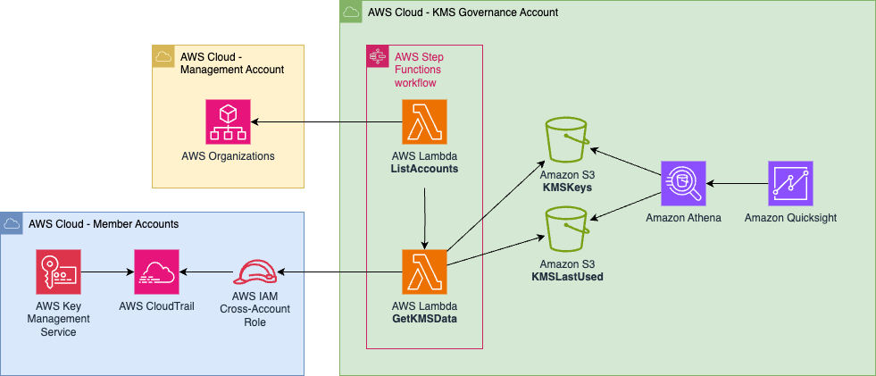

# Data Protection Insights - KMS

## Architecture



## Overview
This solution provides a mechanism for building a data protection insights observability solution. Resources are deployed in one of two account types:

**Security Observability Account** - Hosts the central resources (e.g. Step Functions, Lambda functions and Quicksight)   
**Member Accounts** - IAM Role that allows the Lambda function to assume into   

This git repository contains a services of CloudFormation scripts for deploying into these two accounts types.

## Instructions
### 1. Security Observability Account
Deploy the following:
| Order | command/filename | Stack / Stackset | Single Region / Multi-Region|
| ----- | ----- | ----- | ----- |
| # 1 | ```sam build && sam deploy --guided --capabilities CAPABILITY_NAMED_IAM CAPABILITY_IAM CAPABILITY_AUTO_EXPAND``` | Stack | Single |


To deploy without the KMS analytics stack, use:
```sam build && sam deploy --guided --capabilities CAPABILITY_NAMED_IAM CAPABILITY_IAM CAPABILITY_AUTO_EXPAND --parameter-overrides DeployKMSAnalytics=n```

#### For local deployment
sam deploy --guided --parameter-overrides DeploymentType=local

#### For deployment that gets list of accounts from AWS Organizations
sam deploy --guided --parameter-overrides DeploymentType=org

#### For list deployment
sam deploy --guided --parameter-overrides DeploymentType=list listofaccounts="111111111111,222222222222"


### 2. All Member Accounts
Deploy the following as StackSets from your **`AWS Organizations Management`** account / [delegated CloudFormation account](https://docs.aws.amazon.com/AWSCloudFormation/latest/UserGuide/stacksets-orgs-delegated-admin.html):

| Order | command/filename | Stack / Stackset | Single Region / Multi-Region|
| ----- | ----- | ----- | ----- |
| # 1 | member-account-kmsread-role.yaml | Stackset | Multi |